<p align="center">
  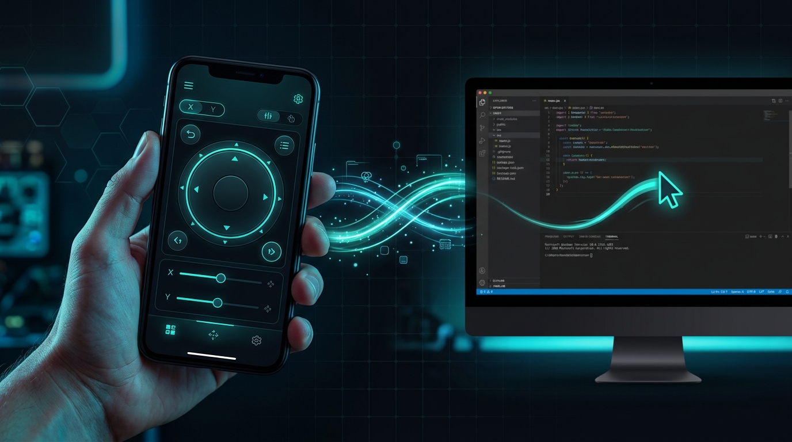
</p>

<h1 align="center">🕷️ SPIDER_CTRL</h1>

<p align="center">
  <strong>Turn your smartphone into a powerful remote control for your computer.</strong><br>
  Touchpad · Keyboard · Live Screen Streaming · Terminal · Process Manager · File Browser
</p>

<p align="center">
  <a href="#-quick-start-guide"></a>
  <a href="#-features-overview"></a>
  <a href="#-real-world-use-cases"></a>
  <a href="#-api-reference"></a>
</p>

<p align="center">
  
  
  
  
  
  
  
  
  
  
</p>

<p align="center">
  <em>No cloud. No account. No agent phoning home. Your phone talks directly to your computer over your own Wi-Fi.</em>
</p>

---

## 📖 Table of Contents

- [Why SPIDER_CTRL?](#-why-spider_ctrl)
- [Features Overview](#-features-overview)
- [Live App Interface Gallery](#-live-app-interface-gallery)
- [Real-World Use Cases](#-real-world-use-cases)
- [Architecture](#-architecture)
- [Quick Start Guide](#-quick-start-guide)
- [Detailed Installation Guide](#-detailed-installation-guide)
- [Connecting Your Phone](#-connecting-your-phone)
- [Install as an App (PWA)](#-install-as-an-app-pwa)
- [Enabling HTTPS/TLS](#-enabling-httpstls)
- [Deploying the Frontend to Vercel](#-deploying-the-frontend-to-vercel)
- [Platform Support Matrix](#-platform-support-matrix)
- [Configuration Reference](#-configuration-reference)
- [API Reference](#-api-reference)
- [Project Structure](#-project-structure)
- [Security Model](#-security-model)
- [Troubleshooting](#-troubleshooting)
- [Development Guide](#-development-guide)
- [Contributing](#-contributing)
- [FAQ](#-frequently-asked-questions)
- [License](#-license)

---

## 💡 Why SPIDER_CTRL?

Most remote desktop solutions are overkill, require installing software on both devices, or route your data through cloud servers you don't control.

**SPIDER_CTRL is different:**

| | SPIDER_CTRL | TeamViewer / AnyDesk | Chrome Remote Desktop |
|---|:---:|:---:|:---:|
| **Requires account** | ❌ No | ✅ Yes | ✅ Yes |
| **Cloud relay** | ❌ Direct LAN | ✅ Cloud servers | ✅ Google servers |
| **Install on phone** | ❌ Just a browser | ✅ App required | ✅ App required |
| **Open source** | ✅ MIT | ❌ Proprietary | ❌ Proprietary |
| **Works offline** | ✅ LAN only | ❌ Needs internet | ❌ Needs internet |
| **Data stays local** | ✅ Always | ❌ Routed through cloud | ❌ Routed through cloud |
| **Custom automation** | ✅ WebSocket API | ❌ | ❌ |
| **Latency** | < 10ms (LAN) | 50–200ms | 50–150ms |

**Zero install on the phone.** Open a URL in your mobile browser — that's it. Install as a PWA for a native-app experience with its own icon and no browser chrome.

**Privacy first.** All traffic stays on your local network. No cloud relay, no telemetry, no account. You can verify this — the source code is right here.

---

## ✨ Features Overview

<p align="center">
  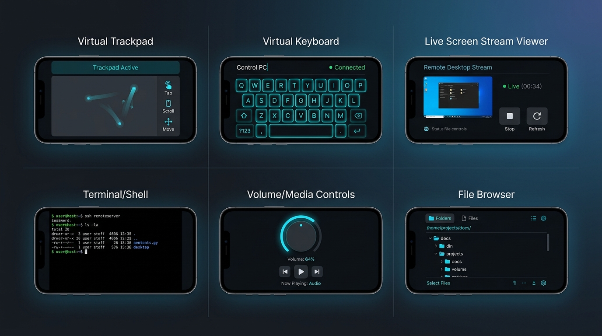
</p>

The interface has **five tabs** across the bottom: **PAD**, **KEYS**, **STRM**, **TOOLS**, **SYS**.

---

### 📱 Live App Interface Gallery

Direct screen captures from the live SPIDER_CTRL mobile client running on a phone connected to the host system over local Wi-Fi:

<p align="center">
  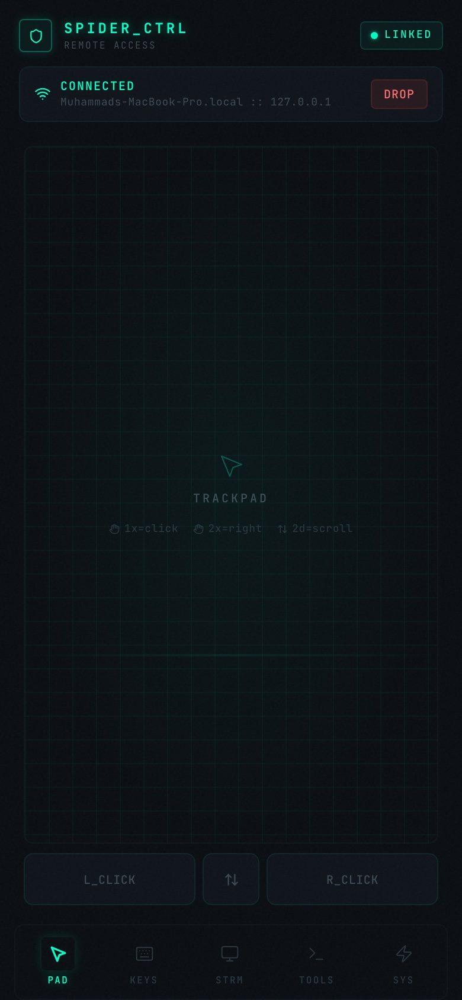
  &nbsp;
  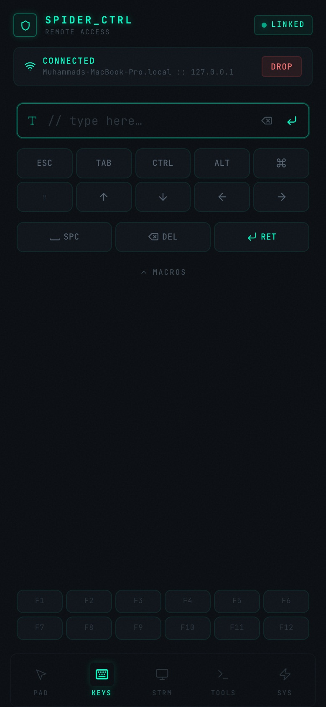
  &nbsp;
  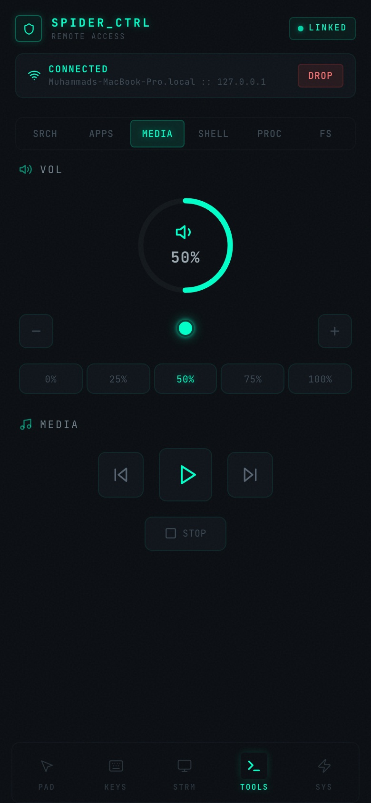
  &nbsp;
  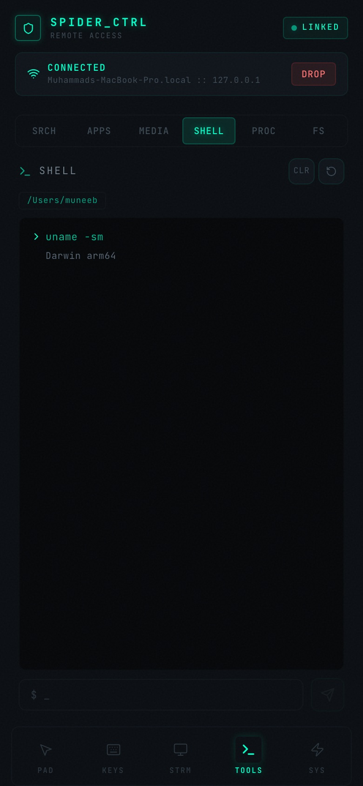
</p>
<p align="center">
  <sub><strong>Left to Right:</strong> 1. Multi-Touch Trackpad · 2. Virtual Keyboard & Macros · 3. Volume Dial & Media Transport · 4. Remote Shell Terminal</sub>
</p>

<p align="center">
  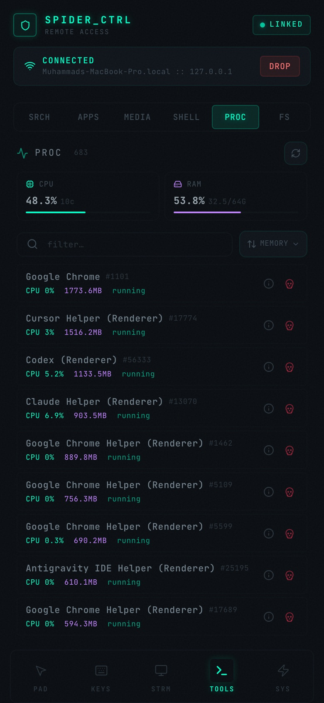
  &nbsp;
  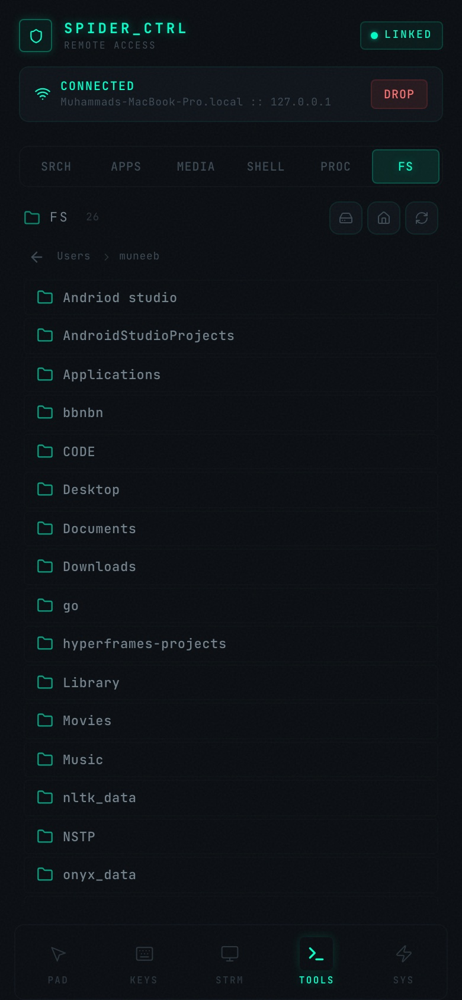
  &nbsp;
  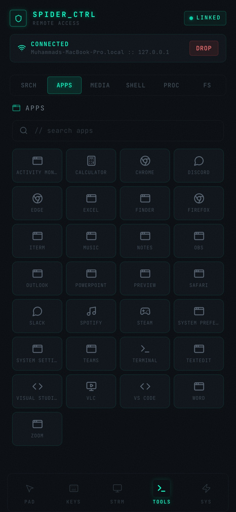
  &nbsp;
  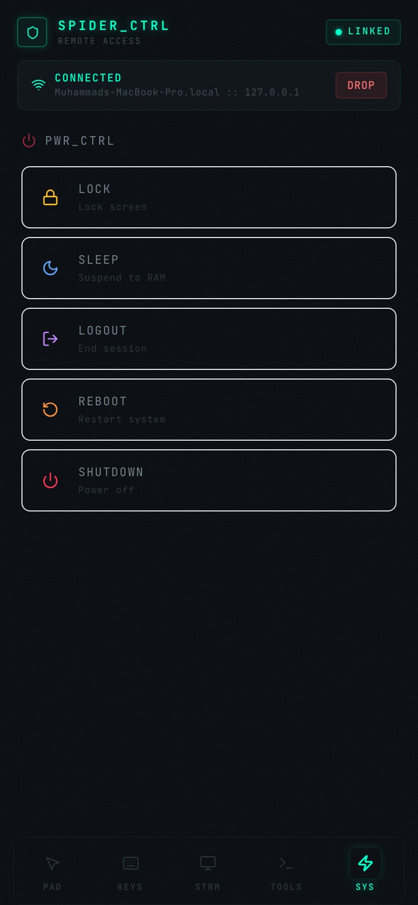
</p>
<p align="center">
  <sub><strong>Left to Right:</strong> 5. Real-Time Process Manager · 6. File Browser · 7. Quick App Launcher · 8. Power & System Controls</sub>
</p>

---

### 🖱️ PAD — Multi-Touch Trackpad

A responsive trackpad that mirrors laptop-grade gestures on your phone screen.

| Gesture | Action |
| --- | --- |
| One finger drag | Move the cursor |
| One finger tap | Left click |
| Two finger drag | Scroll (vertical **and** horizontal) |
| Two finger tap | Right click |
| Three finger tap | Middle click |

- Dedicated `L_CLICK` / middle / `R_CLICK` buttons for precision work
- Relative movement — works regardless of screen dimensions
- Configurable sensitivity (`SENSITIVITY` in `Touchpad.tsx`, default 1.8)
- Jump re-anchoring prevents cursor teleportation when lifting and re-placing fingers
- Peak finger detection for accurate gesture recognition

<p align="center">
  
</p>

### ⌨️ KEYS — Virtual Keyboard

- **Live text input** — every character streams instantly to the host
- **Unicode support** — emoji, accents, CJK characters auto-route through clipboard
- **Modifier keys** — Esc, Tab, Ctrl, Alt, Win/⌘, Shift, arrows
- **Function row** — F1 through F12
- **One-tap macros** — Copy, Paste, Cut, Undo, Select All, Alt+Tab, Alt+F4, Win+D, Ctrl+Shift+Esc, PrintScreen
- **macOS-aware** — `Ctrl` and `Win` automatically remap to `Command` on macOS hosts

<p align="center">
  
</p>

### 🖥️ STRM — Live Screen Streaming

Real-time desktop streaming via **WebRTC** — not screenshot polling, real video.

| Preset | Resolution | FPS | Target Bitrate |
| --- | --- | --- | --- |
| 🟢 Low | 640 × 360 | 15 | 500 kbps |
| 🟡 Medium | 960 × 540 | 24 | 1200 kbps |
| 🟠 High | 1280 × 720 | 30 | 2500 kbps |
| 🔴 Ultra | 1920 × 1080 | 30 | 4000 kbps |

- **Adaptive quality** — auto-adjusts based on real-time network RTT measurements
- **Live stats overlay** — latency, FPS, resolution, bitrate at a glance
- **Fullscreen** with landscape orientation lock on mobile
- **Aspect-ratio preserving** — 16:10, 4:3, and portrait monitors stream undistorted
- **Auto-reconnect** — up to 5 retries if the stream drops
- **Multi-viewer** — multiple phones can stream simultaneously with independent quality

<p align="center">
  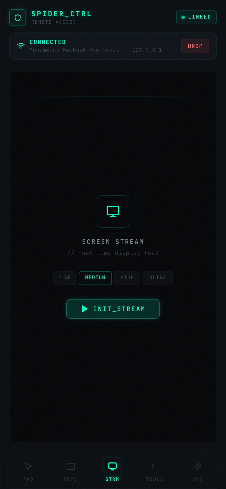
</p>

### 🧰 TOOLS — Six Powerful Utilities

Six sub-tabs: **SRCH**, **APPS**, **MEDIA**, **SHELL**, **PROC**, **FS**.

#### 🔍 SRCH — Google Search & URL

Open any URL or run a Google search directly in the host's default browser. Recent entries are remembered locally. Bare hostnames get `https://` prepended automatically.

<p align="center">
  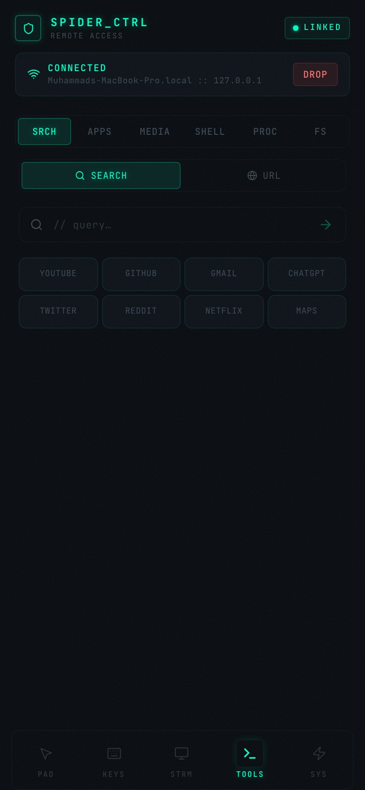
</p>

#### 📱 APPS — App Launcher

A searchable grid of **30+ preconfigured apps** per platform:

- **Windows**: Notepad, Calculator, Chrome, VS Code, Spotify, Discord, Steam, Terminal, Office apps, and more
- **macOS**: Finder, Safari, Chrome, iTerm, Activity Monitor, System Settings, Music, and more
- **Linux**: Nautilus, Firefox, Chrome, gnome-terminal, VS Code, VLC, LibreOffice, and more

Anything not in the list can be launched by typing its command directly.

<p align="center">
  
</p>

#### 🔊 MEDIA — Volume & Media Controls

Circular volume dial with ±5% step controls and mute toggle. Transport controls for play/pause, next, previous, and stop — emits real media keys, works with Spotify, YouTube, VLC, or any focused app.

<p align="center">
  
</p>

#### 💻 SHELL — Remote Terminal

A full shell on the host machine:

- **Persistent working directory** — `cd` sticks between commands
- **Command history** — ↑ / ↓ recall (last 50 commands)
- **Separated output** — stdout and stderr rendered distinctly, with exit codes
- **Timeouts** — 30s default (120s max), 64KB output cap per stream
- **Home-relative paths** — `C:\Users\you\src` displays as `~/src`

<p align="center">
  
</p>

#### ⚙️ PROC — Process Manager

Live process table refreshing every 5 seconds:

- Sort by memory, CPU, name, or PID
- Filter by name
- Per-process detail: executable path, command line, thread count, user, start time
- Graceful terminate (SIGTERM) or force kill (SIGKILL)
- System summary: CPU %, core count, RAM used/total
- PIDs 0 and 4 are protected from being killed

<p align="center">
  
</p>

#### 📁 FS — File Browser

Read-only filesystem browser:

- Drive and mount-point picker (`C:\`, `D:\` on Windows; `/`, `/home`, `/mnt` on Unix)
- Folders first, then alphabetical; sizes and modified timestamps
- Per-extension icons for code, documents, images, video, audio, and archives
- Symlinks flagged; hidden and system files filtered by default

> **Safe by design** — file contents are never transmitted. Nothing can be created, moved, or deleted.

<p align="center">
  
</p>

### ⚡ SYS — Power & System Controls

Shutdown, Restart, Sleep, Lock Screen, and Log Out — each behind a confirmation step. Works on **Windows, macOS, and Linux**. The host's OS, hostname, CPU, RAM, and battery level are shown alongside.

<p align="center">
  
</p>

### 📋 Clipboard Sync

Read and write the host clipboard remotely:
- **Windows**: PowerShell
- **macOS**: `pbcopy` / `pbpaste`
- **Linux**: `wl-clipboard`, `xclip`, or `xsel`

### 📡 Auto-Discovery

The server broadcasts a UDP beacon on port 8766 every 2 seconds. When you open the UI from the same network, the app can auto-detect and connect — no IP to type.

---

## 🌍 Real-World Use Cases

<p align="center">
  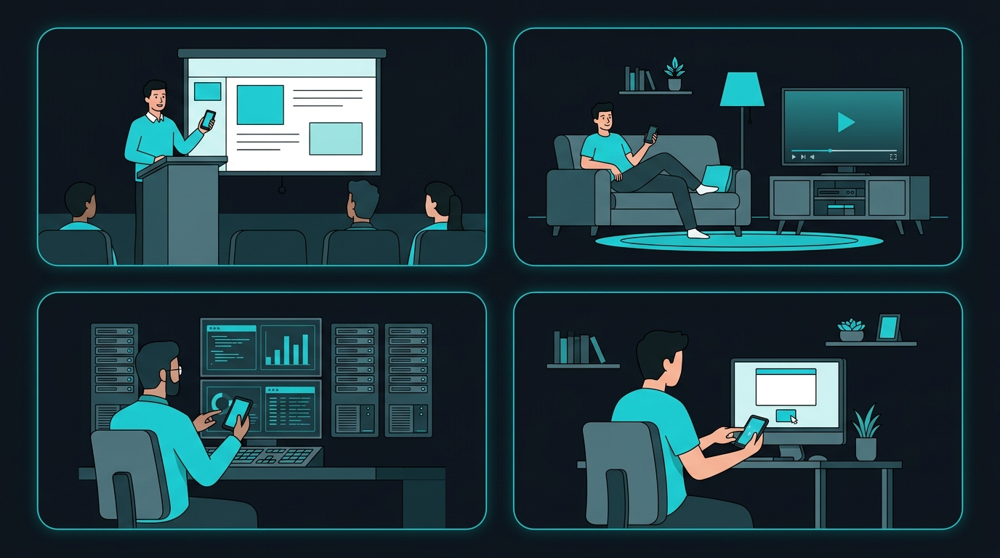
</p>

### 🎤 Presentations & Lectures

Control your presentation slides wirelessly from your phone. Walk around the room while advancing slides, switching apps, or adjusting volume — no need for a \$50 Logitech clicker.

> **Example workflow:** Stand at the podium → open SPIDER_CTRL on your phone → use the trackpad to advance PowerPoint slides → switch to a demo app → adjust volume for a video — all from your phone.

### 🎬 Home Media Center

Turn your HTPC or connected laptop into a media center controlled from the couch. Browse media files, launch VLC/Spotify, adjust volume, and control playback without getting up.

> **Example workflow:** Couch → launch Spotify from the app launcher → control volume with the media dial → skip tracks → search for a YouTube video → stream it on the big screen.

### 🖥️ IT Support & Server Monitoring

Monitor server processes, check system resources, kill hanging processes, and execute diagnostic commands — all from your phone while walking between server racks.

> **Example workflow:** Walk to server rack → open Process Manager → sort by CPU usage → identify the runaway process → kill it → run a diagnostic command in the terminal → verify the fix.

### ♿ Accessibility & Alternative Input

Use your phone as an adaptive input device when a traditional mouse or keyboard isn't practical. The touchpad works as a high-precision pointer, and the virtual keyboard handles full text input.

### 🏠 Remote Desktop for Home Use

Your computer is in the office, but you need to check something while you're in the kitchen. No need to walk back — pull out your phone, stream the screen, and handle it remotely.

### 🎮 Gaming & Streaming Setup

Control OBS scene switching, adjust audio levels, or manage your streaming overlay from your phone while gaming. Keep your hands on the keyboard and mouse while using the phone for auxiliary controls.

### 👨‍💻 Developer Workflow

Run build commands, check logs, restart services, or browse project files from your phone while stepping away from your desk. The remote terminal supports full command execution.

> **Example workflow:** Step away from desk → run `npm run build` in the terminal → check the output → browse the `/dist` folder in the file browser → verify the build.

---

## 🏗️ Architecture

<p align="center">
  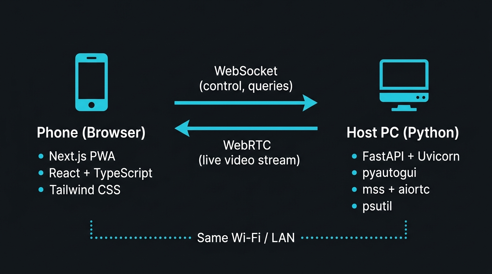
</p>

### Technology Stack

| Layer | Technology | Runs On |
| --- | --- | --- |
| **UI Framework** | Next.js 14 (App Router) + React 18 + TypeScript | Phone browser |
| **Styling** | Tailwind CSS + Framer Motion, JetBrains Mono | Phone browser |
| **Control Channel** | WebSocket (JSON request/response) | LAN |
| **Video Channel** | WebRTC (aiortc ⇄ browser), H.264/VP8 | LAN |
| **Server** | FastAPI + Uvicorn (Python) | Host PC |
| **Input Automation** | pyautogui | Host PC |
| **Screen Capture** | mss + NumPy + PyAV | Host PC |
| **System Control** | psutil, pycaw (Win) / osascript (Mac) / pactl (Linux) | Host PC |

### Why Two Channels?

**WebSocket** for control — small, ordered messages that need replies (mouse moves, key presses, shell commands).

**WebRTC** for video — continuous high-bandwidth stream that tolerates packet loss, with built-in NAT traversal and congestion control.

### One Server, Two Jobs

The Python server both handles API requests AND serves the frontend as static files. A phone on the same network just browses to `http://<pc-ip>:8765` — nothing else to deploy.

---

## 🚀 Quick Start Guide

Get running in under 2 minutes.

### Prerequisites

| Component | Requirement |
| --- | --- |
| **Host PC** | Python 3.10+ (3.11+ recommended) |
| **Frontend Build** | Node.js 18+ and npm |
| **Operating System** | Windows 10/11, macOS 11+, or Linux (X11/Wayland) |
| **Phone** | Any modern browser (Chrome, Safari, Firefox, Edge) |
| **Network** | Same Wi-Fi, LAN, or hotspot |

### One-Command Start

<details>
<summary><b>🪟 Windows</b></summary>

```bat
git clone https://github.com/muneebkhan08/test_mob_ctrl.git
cd test_mob_ctrl
start-server.bat
```

The batch file handles venv creation, dependency installation, frontend build, and server launch automatically.

</details>

<details>
<summary><b>🍎 macOS</b></summary>

```bash
git clone https://github.com/muneebkhan08/test_mob_ctrl.git
cd test_mob_ctrl
chmod +x start-server.sh
./start-server.sh
```

> **First time on macOS?** You'll need to grant **Accessibility** and **Screen Recording** permissions:
> System Settings → Privacy & Security → Accessibility → add Terminal/Python.
> System Settings → Privacy & Security → Screen Recording → add Terminal/Python.

</details>

<details>
<summary><b>🐧 Linux</b></summary>

```bash
git clone https://github.com/muneebkhan08/test_mob_ctrl.git
cd test_mob_ctrl
chmod +x start-server.sh
./start-server.sh
```

> **Note:** X11 works out of the box. Wayland restricts synthetic input — run under XWayland or an X11 session for full functionality.

</details>

### You Should See

```
════════════════════════════════════════════════════════
  🖥️  SPIDER_CTRL Server v1.0.0
  🌐  Open on phone → http://192.168.1.42:8765
  🔌  WebSocket  →  ws://192.168.1.42:8765/ws
  🎥  WebRTC     →  /webrtc/offer
  📡  UDP Disco   →  port 8766
  🔒  TLS         →  disabled (set SPIDER_CTRL_TLS=1)
  💻  Platform    →  Windows 10
════════════════════════════════════════════════════════
```

**Open that `http://…:8765` URL on your phone. That's it.**

---

## 📥 Detailed Installation Guide

Step-by-step for all platforms.

### Step 1: Clone the Repository

```bash
git clone https://github.com/muneebkhan08/test_mob_ctrl.git
cd test_mob_ctrl
```

### Step 2: Build the Frontend

```bash
cd frontend
npm install
npm run build     # Creates static export in frontend/out/
cd ..
```

> The `npm run build` command produces a static export of the Next.js app. This is what the Python server serves to your phone.

### Step 3: Set Up the Python Server

```bash
cd server

# Create a virtual environment
python -m venv venv

# Activate it
# Windows:
venv\Scripts\activate
# macOS / Linux:
source venv/bin/activate

# Install dependencies
pip install -r requirements.txt
```

### Step 4: Run the Server

```bash
python server.py
```

### Step 5: Connect Your Phone

1. Make sure your phone is on the **same Wi-Fi network** as your computer
2. Open the URL shown in the terminal (e.g., `http://192.168.1.42:8765`)
3. The app connects automatically — start controlling your PC!

### Updating

```bash
cd test_mob_ctrl
git pull
cd frontend && npm install && npm run build && cd ..
cd server && pip install -r requirements.txt && cd ..
```

---

## 📲 Connecting Your Phone

### Method 1: Same Wi-Fi (Simplest)

Both devices on the same router. Browse to the IP the server printed.

### Method 2: PC as Hotspot

1. **Windows:** Settings → Network → Mobile Hotspot → On
   **macOS:** System Settings → General → Sharing → Internet Sharing
2. Connect the phone to that hotspot
3. Use the host's hotspot IP (usually `192.168.137.1` on Windows)

### Method 3: Phone as Hotspot

1. Enable the hotspot on your phone
2. Connect the PC to it
3. Start the server and use whichever IP it prints

### Finding the Host IP Manually

```bash
ipconfig                      # Windows
ifconfig | grep "inet "       # macOS
hostname -I                   # Linux
```

---

## 📱 Install as an App (PWA)

SPIDER_CTRL is a Progressive Web App — install it on your phone for a native-app experience:

**iOS (Safari):**
1. Open the server URL in Safari
2. Tap the **Share** button (⬆️)
3. Tap **Add to Home Screen**
4. Tap **Add**

**Android (Chrome):**
1. Open the server URL in Chrome
2. Tap the **⋮** menu
3. Tap **Add to Home screen** or **Install app**

Once installed, it launches fullscreen with no browser chrome, its own icon, and the dark theme applied to the status bar.

---

## 🔐 Enabling HTTPS/TLS

SPIDER_CTRL supports optional TLS encryption for secure connections:

```bash
# Enable TLS with a single environment variable
SPIDER_CTRL_TLS=1 python server.py
```

**What happens:**
1. A self-signed SSL certificate is auto-generated with your local IP in the SAN
2. The certificate regenerates automatically when your IP changes
3. The server starts on `https://` and `wss://` instead of plain HTTP
4. You'll need to accept the self-signed certificate warning on your phone (once per IP change)

**On Windows:**

```bat
set SPIDER_CTRL_TLS=1
python server.py
```

> **Note:** TLS encrypts the channel but doesn't authenticate clients. For trusted networks, plain HTTP is fine. Enable TLS if you want encryption on the wire.

---

## ☁️ Deploying the Frontend to Vercel

Optional. Hosting the UI on Vercel gives you a stable URL to bookmark instead of a changing IP.

1. Push the repo to GitHub
2. Vercel → **Add New** → **Project** → import the repo
3. **Set Root Directory to `frontend`** (critical — the repo root has no `package.json`)
4. Framework preset: `Next.js`. Leave all other settings at defaults.
5. Deploy

**How it works:** The Vercel-hosted page acts as a launcher. You type the host IP, tap **Go**, and it redirects to `http://<ip>:8765` where the server handles everything same-origin. The last IP is remembered.

See [DEPLOYMENT.md](DEPLOYMENT.md) for the click-by-click walkthrough.

---

## 💻 Platform Support Matrix

| Feature | Windows | macOS | Linux |
| --- | :---: | :---: | :---: |
| Mouse / Keyboard | ✅ | ✅ ¹ | ✅ ² |
| Screen Streaming | ✅ | ✅ ¹ | ✅ |
| Terminal | ✅ | ✅ | ✅ |
| Process Manager | ✅ | ✅ | ✅ |
| File Browser | ✅ | ✅ | ✅ |
| App Launcher | ✅ | ✅ | ✅ |
| Power Controls | ✅ | ✅ | ✅ |
| Volume | ✅ pycaw | ✅ osascript | ✅ pactl |
| Media Keys | ✅ | ✅ | ⚠️ ³ |
| Clipboard | ✅ | ✅ | ✅ ⁴ |

> ¹ macOS needs **Accessibility** and **Screen Recording** permissions for the terminal or Python binary: System Settings → Privacy & Security.
>
> ² X11 works out of the box. Wayland restricts synthetic input; run under XWayland or an X11 session.
>
> ³ Media keys depend on the desktop environment honouring XF86 key symbols.
>
> ⁴ Linux needs `wl-clipboard`, `xclip`, or `xsel` installed.

`pycaw` and `comtypes` are marked `sys_platform == "win32"` in `requirements.txt`, so `pip install -r requirements.txt` is safe on all platforms.

---

## ⚙️ Configuration Reference

### Server Configuration

Constants at the top of `server/server.py`:

| Constant | Default | Description |
| --- | --- | --- |
| `SERVER_PORT` | `8765` | HTTP + WebSocket port |
| `UDP_PORT` | `8766` | Discovery broadcast port |
| `BROADCAST_INTERVAL` | `2` | Seconds between UDP beacons |

### Environment Variables

| Variable | Values | Description |
| --- | --- | --- |
| `SPIDER_CTRL_TLS` | `1`, `true`, `yes` | Enable HTTPS/WSS with auto-generated self-signed certificates |

### Controller Configuration

| File | Constant | Default | Description |
| --- | --- | --- | --- |
| `controllers/terminal.py` | `DEFAULT_TIMEOUT` | 30s | Shell command timeout |
| `controllers/terminal.py` | `MAX_TIMEOUT` | 120s | Maximum allowed timeout |
| `controllers/terminal.py` | `MAX_OUTPUT_BYTES` | 64 KB | Output cap per stream |
| `controllers/screen.py` | `QUALITY_PRESETS` | see table above | WebRTC stream quality |

### Frontend Configuration

| File | Constant | Default | Description |
| --- | --- | --- | --- |
| `Touchpad.tsx` | `SENSITIVITY` | `1.8` | Trackpad sensitivity multiplier |
| `useWebSocket.tsx` | `RECONNECT_DELAY` | 3000 ms | WebSocket reconnect interval |

### Theme Customization

Theme colours are defined in two places — change both to restyle:
- CSS variables in `app/globals.css`
- Tailwind tokens in `tailwind.config.js`

---

## 📡 API Reference

### WebSocket Protocol

**Endpoint:** `ws://<host>:8765/ws`

All frames are JSON. Request-response pairing uses an optional `id` field.

**Request format:**

```jsonc
{
  "action": "mouse_move",
  "payload": { "dx": 10, "dy": -5 },
  "id": "req_1"      // optional — include to get a reply
}
```

**Response format:**

```jsonc
{ "ok": true,  "data": { "moved": [10, -5] }, "id": "req_1" }
{ "ok": false, "error": "Process 1234 does not exist", "id": "req_1" }
```

> **Performance tip:** Fire-and-forget messages (cursor movement, key presses) omit `id` and get no reply, keeping the trackpad smooth at 60+ events/second.

### Action Reference

<details>
<summary><b>🖱️ Mouse Actions</b></summary>

| Action | Payload | Description |
| --- | --- | --- |
| `mouse_move` | `{dx, dy}` | Relative cursor move |
| `mouse_click` | `{button}` — `left`\|`right`\|`middle` | Click |
| `mouse_double_click` | — | Double click |
| `mouse_right_click` | — | Right click |
| `mouse_scroll` | `{dx, dy}` | Scroll both axes |
| `mouse_drag_start` | — | Press and hold |
| `mouse_drag_move` | `{dx, dy}` | Move while held |
| `mouse_drag_end` | — | Release |

</details>

<details>
<summary><b>⌨️ Keyboard Actions</b></summary>

| Action | Payload | Description |
| --- | --- | --- |
| `key_press` | `{key}` | Press one key |
| `key_combo` | `{keys: [...]}` | Chord, e.g. `["ctrl","shift","esc"]` |
| `key_type` | `{text}` | Type a string (unicode via clipboard) |

</details>

<details>
<summary><b>⚡ Power Actions</b></summary>

| Action | Payload | Description |
| --- | --- | --- |
| `power_shutdown` | `{delay?}` | Shut down after `delay` seconds |
| `power_restart` | `{delay?}` | Restart |
| `power_sleep` | — | Suspend |
| `power_lock` | — | Lock the screen |
| `power_logout` | — | Log the user out |

</details>

<details>
<summary><b>📱 App & Search Actions</b></summary>

| Action | Payload | Description |
| --- | --- | --- |
| `app_open` | `{name}` or `{path}` | Launch by friendly name or command |
| `app_list` | — | Quick-launch names + running processes |
| `app_close` | `{name}` or `{pid}` | Terminate |
| `google_search` | `{query}` | Search in the default browser |
| `url_open` | `{url}` | Open a URL |

</details>

<details>
<summary><b>🔊 Volume & Media Actions</b></summary>

| Action | Payload | Description |
| --- | --- | --- |
| `volume_get` | — | `{volume, muted}` |
| `volume_set` | `{level}` | Set 0–100 |
| `volume_up` / `volume_down` | `{step?}` | Step, default 5 |
| `volume_mute` | — | Toggle mute |
| `media_play_pause` | — | Play / pause |
| `media_next` / `media_prev` | — | Track change |
| `media_stop` | — | Stop |

</details>

<details>
<summary><b>💻 Terminal Actions</b></summary>

| Action | Payload | Description |
| --- | --- | --- |
| `terminal_execute` | `{command, timeout?}` | `{stdout, stderr, exit_code, cwd}` |
| `terminal_cwd` | — | Current directory |
| `terminal_set_cwd` | `{path}` | Change directory |
| `terminal_reset` | — | Back to home |

</details>

<details>
<summary><b>⚙️ Process Actions</b></summary>

| Action | Payload | Description |
| --- | --- | --- |
| `process_list` | `{sort_by?, limit?, search?}` | Processes + system summary |
| `process_detail` | `{pid}` | exe, cmdline, threads, user, start time |
| `process_kill` | `{pid, force?}` | SIGTERM, or SIGKILL when `force` |

</details>

<details>
<summary><b>📁 Filesystem Actions</b></summary>

| Action | Payload | Description |
| --- | --- | --- |
| `fs_list` | `{path?, show_hidden?}` | Entries with metadata |
| `fs_drives` | — | Drives / mount points |
| `fs_info` | `{path}` | Single-entry detail |

</details>

<details>
<summary><b>📋 Clipboard & System Info</b></summary>

| Action | Payload | Description |
| --- | --- | --- |
| `clipboard_get` | — | `{text}` |
| `clipboard_set` | `{text}` | `{copied: true}` |
| `system_info` | — | Host, OS, CPU, RAM, battery |

</details>

### HTTP Endpoints

| Method | Path | Purpose |
| --- | --- | --- |
| `GET` | `/health` | Server status, IP, platform, active stream count |
| `GET` | `/{path}` | Static frontend (SPA fallback to `index.html`) |

### WebRTC Signalling API

| Method | Path | Body | Returns |
| --- | --- | --- | --- |
| `POST` | `/webrtc/offer` | `{sdp, type, quality}` | `{connection_id, sdp, type, quality}` |
| `POST` | `/webrtc/ice` | `{connection_id, candidate}` | `{ok}` |
| `POST` | `/webrtc/quality` | `{connection_id, quality}` | `{ok, quality}` |
| `POST` | `/webrtc/stop` | `{connection_id}` | `{ok}` |
| `GET` | `/webrtc/stats/{id}` | — | Connection and ICE state |

**Flow:** Browser creates offer → `POST /webrtc/offer` → server attaches screen capture track and answers → ICE candidates trickle both ways → video flows. A data channel named `stats` carries RTT reports and quality changes without HTTP round-trips.

### UDP Discovery

The server broadcasts to port **8766** every 2 seconds:

```json
{
  "service": "SPIDER_CTRL Server",
  "version": "1.0.0",
  "ip": "192.168.1.42",
  "port": 8765,
  "hostname": "DESKTOP-ABC",
  "platform": "Windows"
}
```

---

## 📁 Project Structure

```
test_mob_ctrl/
├── assets/                          # README images
├── frontend/                        # Next.js PWA (static export)
│   ├── app/
│   │   ├── page.tsx                 # Tab shell and layout
│   │   ├── layout.tsx               # Metadata, PWA manifest, icons
│   │   ├── globals.css              # Cyberpunk theme, animations
│   │   ├── hooks/
│   │   │   ├── useWebSocket.tsx     # Control channel, reconnect, req/res
│   │   │   └── useWebRTC.tsx        # Video channel, signalling, stats
│   │   └── components/
│   │       ├── ConnectionBar.tsx    # Connect / redirect / status
│   │       ├── Touchpad.tsx         # Multi-touch trackpad
│   │       ├── Keyboard.tsx         # Text, keys, macros
│   │       ├── ScreenViewer.tsx     # Video surface + quality UI
│   │       ├── RemoteTerminal.tsx   # Shell emulator
│   │       ├── ProcessManager.tsx   # Process table
│   │       ├── FileBrowser.tsx      # Filesystem browser
│   │       ├── AppLauncher.tsx      # App grid
│   │       ├── GoogleSearch.tsx     # Search / URL
│   │       ├── MediaVolume.tsx      # Volume + transport
│   │       └── PowerControls.tsx    # Power actions
│   ├── public/                      # manifest.json, PWA icons
│   └── out/                         # Build output — served by the server
│
├── server/                          # FastAPI server (runs on the host)
│   ├── server.py                    # App, WS endpoint, dispatch, UDP beacon
│   ├── requirements.txt             # Python dependencies with platform markers
│   ├── controllers/
│   │   ├── mouse.py                 # Move, click, scroll, drag
│   │   ├── keyboard.py              # Keys, combos, text, unicode
│   │   ├── screen.py                # Capture + WebRTC track + quality
│   │   ├── terminal.py              # Shell with persistent cwd
│   │   ├── processes.py             # List / inspect / kill
│   │   ├── filesystem.py            # Read-only browsing
│   │   ├── apps.py                  # Launch and close apps (cross-platform)
│   │   ├── power.py                 # Shutdown, restart, sleep, lock (cross-platform)
│   │   ├── volume.py                # Per-platform volume control
│   │   ├── media.py                 # Media keys
│   │   ├── clipboard.py             # Per-platform clipboard
│   │   ├── search.py                # Google / URL
│   │   └── system_info.py           # CPU, RAM, battery
│   ├── utils/
│   │   ├── network.py               # LAN IP detection
│   │   └── ssl_cert.py              # Self-signed cert generator
│   └── certs/                       # Generated at runtime — gitignored
│
├── start-server.bat                 # Windows launcher
├── start-server.sh                  # macOS / Linux launcher
├── DEPLOYMENT.md                    # Vercel deployment walkthrough
└── README.md
```

---

## 🔒 Security Model

> [!WARNING]
> **SPIDER_CTRL has no authentication.** Anyone who can reach port 8765 on your machine gets full control. Run it only on networks you trust.

### What's Exposed

- The server binds `0.0.0.0` — every interface, reachable by anything on the network
- `terminal_execute` runs arbitrary commands as the user running the server
- `process_kill` can terminate any process that user owns
- `power_shutdown` and friends need no confirmation at the protocol level
- `fs_list` browses the entire filesystem (names and metadata only, not contents)
- CORS is `allow_origins=["*"]`
- Traffic is plaintext by default (enable TLS with `SPIDER_CTRL_TLS=1`)

### Safe Networks

| ✅ Safe | ❌ Unsafe |
| --- | --- |
| Home Wi-Fi with WPA2/WPA3 | Café, airport, hotel Wi-Fi |
| Your own hotspot | Campus Wi-Fi with guests |
| Isolated LAN | Port forwarding to the internet |

### Hardening Checklist

- [ ] **Run only while using it** — the UDP beacon advertises your server to the entire subnet
- [ ] **Firewall it** — allow 8765/tcp and 8766/udp on private profiles only
- [ ] **Enable TLS** — `SPIDER_CTRL_TLS=1` encrypts traffic with auto-generated certs
- [ ] **Run as unprivileged user** — don't launch from an admin/root shell
- [ ] **Don't tunnel it** — no ngrok, no Tailscale funnel, no port forwarding

**Windows firewall rules (elevated PowerShell):**

```powershell
New-NetFirewallRule -DisplayName "SPIDER_CTRL" -Direction Inbound -Protocol TCP -LocalPort 8765 -Profile Private -Action Allow
New-NetFirewallRule -DisplayName "SPIDER_CTRL Disco" -Direction Inbound -Protocol UDP -LocalPort 8766 -Profile Private -Action Allow
```

### About the Committed Certificate

The repo's first commit included a self-signed `key.pem`. Those files are no longer tracked, and `.gitignore` now covers them. They remain in git history — use `git filter-repo` to purge if needed. The practical impact is low as the key was never wired into the running server.

---

## 🔧 Troubleshooting

| Symptom | Solution |
| --- | --- |
| Phone can't reach the server | Confirm both devices are on the same network, then check the firewall — this is nearly always the firewall |
| `Connection failed` in the app | Is `server.py` running? Does `http://<ip>:8765/health` load in the phone's browser? |
| Server prints `127.0.0.1` | No LAN connection detected. Connect to Wi-Fi, or read the IP from `ipconfig` / `ifconfig` |
| Blank page at `:8765` | Frontend isn't built — `cd frontend && npm run build` |
| Vercel build fails | Root Directory must be set to `frontend`, not the repo root |
| Trackpad does nothing | Does the console show `Client connected`? On macOS, grant Accessibility permission |
| Stream stuck on `ESTABLISHING…` | Restart the server; if it persists: `pip install --force-reinstall aiortc av` |
| Stream is choppy | Drop to Low or Medium quality; 5 GHz Wi-Fi helps a lot |
| Volume shows `-1` | Windows: `pip install pycaw comtypes`. Linux: install `pulseaudio-utils` for `pactl` |
| Unicode typing does nothing | Linux needs a clipboard tool — `sudo apt install xclip` |
| `process_kill` → access denied | That process belongs to another user or the system; needs elevation |
| Terminal command times out | Default limit is 30s — pass `{"timeout": 120}` for long jobs |
| `ModuleNotFoundError: pycaw` on macOS/Linux | This is expected — `pycaw` is Windows-only and gated by platform markers |
| Screen recording permission on macOS | System Settings → Privacy & Security → Screen Recording → add your Terminal or Python binary |

---

## 🛠️ Development Guide

### Running in Development Mode

```bash
# Terminal 1: Frontend with hot reload on :3000
cd frontend && npm run dev

# Terminal 2: Server (restart manually after edits)
cd server && python server.py
```

Open `http://localhost:3000` on your desktop and connect to `localhost` in the connection bar. For phone testing, use your LAN IP — `next dev` binds all interfaces.

### Code Quality

```bash
npx tsc --noEmit      # TypeScript type check
npm run lint          # ESLint
npm run build         # Production static export → out/
```

### Adding a New Action

1. **Write the handler** — create or extend a controller in `server/controllers/`. Accept `**_` so unexpected payload keys don't raise:

   ```python
   class MyController:
       def my_action(self, param1: str = "", **_):
           # Your logic here
           return {"result": "success"}
   ```

2. **Register it** in the `HANDLERS` table in `server/server.py`:

   ```python
   HANDLERS = {
       ...
       "my_action": my_controller.my_action,
   }
   ```

3. **Call it from the UI** with `send("my_action", {...})` or `sendAndWait` if you need the reply.

> **Threading note:** Handlers run in a worker thread via `asyncio.to_thread()`, so blocking calls are fine. Keep anything on the input path fast, since the trackpad shares the socket.

### Adding a New Frontend Component

1. Create the component in `frontend/app/components/`
2. Import and add it to the appropriate tab in `page.tsx`
3. Use `useWebSocket()` for control messages:

   ```tsx
   const { send, sendAndWait } = useWebSocket();
   
   // Fire and forget (fast, no reply)
   send("my_action", { param1: "value" });
   
   // Wait for response (slower, gets data back)
   const result = await sendAndWait("my_action", { param1: "value" });
   ```

---

## 🤝 Contributing

Contributions are welcome! Here's how you can help:

1. **Fork** the repository
2. **Create** a feature branch (`git checkout -b feature/amazing-feature`)
3. **Commit** your changes (`git commit -m 'Add amazing feature'`)
4. **Push** to the branch (`git push origin feature/amazing-feature`)
5. **Open** a Pull Request

### Ideas for Contributions

- 🔐 Authentication system (shared PIN/token)
- 🎨 Theme customization UI
- 📊 System monitoring dashboard with charts
- 🔊 Per-app volume control (Windows)
- 📱 Notification forwarding
- 🖥️ Multi-monitor support for screen streaming
- 🎮 Gamepad emulation
- 📂 File upload/download support

---

## ❓ Frequently Asked Questions

<details>
<summary><b>Does SPIDER_CTRL work over the internet?</b></summary>

No, by design. SPIDER_CTRL is meant for local network use only. Exposing it to the internet would be a major security risk since there's no authentication. Use it on your home Wi-Fi, a personal hotspot, or an isolated LAN.

</details>

<details>
<summary><b>Is there any latency?</b></summary>

Over a local network, control latency is typically **under 10ms** — you won't notice it. Screen streaming latency depends on quality settings and Wi-Fi speed, typically 30–100ms on a 5 GHz network.

</details>

<details>
<summary><b>Can I use this on multiple computers?</b></summary>

Yes! Run the server on each computer. Each will broadcast its own UDP beacon. On your phone, connect to whichever IP you want to control.

</details>

<details>
<summary><b>Does it work with dual monitors?</b></summary>

The screen streaming captures the primary monitor. The mouse and keyboard control the full desktop across all monitors.

</details>

<details>
<summary><b>Can my phone and PC be on different Wi-Fi networks?</b></summary>

No — they must be on the same local network. The simplest fix is to create a hotspot on either device and connect the other to it.

</details>

<details>
<summary><b>Is my data sent to any cloud server?</b></summary>

No. All traffic stays on your local network. The only external requests are to Google STUN servers (for WebRTC NAT traversal) and Google Fonts (for the JetBrains Mono typeface). Neither carries your data.

</details>

<details>
<summary><b>Can someone on my network hack my computer through this?</b></summary>

If someone on your network can reach port 8765, they have full control — terminal, process manager, power controls, everything. Only run SPIDER_CTRL on networks you trust (home Wi-Fi, personal hotspot). See the [Security Model](#-security-model) section.

</details>

<details>
<summary><b>Why does macOS ask for permissions?</b></summary>

macOS requires explicit user consent for apps that control input (Accessibility) or capture the screen (Screen Recording). Grant these in System Settings → Privacy & Security for your terminal or Python binary.

</details>

<details>
<summary><b>Can I customize the app's appearance?</b></summary>

Yes! The theme is defined in `frontend/app/globals.css` (CSS variables) and `frontend/tailwind.config.js` (Tailwind tokens). Change both files and rebuild with `npm run build`.

</details>

---

## 📄 License

MIT — use it, fork it, change it, ship it.

---

<p align="center">
  <b>If you find SPIDER_CTRL useful, give it a ⭐ on GitHub!</b><br>
  <a href="https://github.com/muneebkhan08/test_mob_ctrl">github.com/muneebkhan08/test_mob_ctrl</a>
</p>

<!-- SEO Keywords: remote desktop control, phone remote control PC, mobile remote control computer, WebSocket remote desktop, WebRTC screen sharing, Python remote desktop, FastAPI remote control, smartphone as trackpad, phone as wireless mouse, phone as keyboard, remote PC control from phone, LAN remote desktop, local network remote control, open source remote desktop, no cloud remote desktop, privacy focused remote control, PWA remote desktop, self-hosted remote desktop, cross-platform remote control, wireless touchpad phone, mobile process manager, remote terminal from phone, screen mirroring LAN, remote volume control, remote power control, remote file browser, pyautogui remote control, Next.js PWA remote desktop -->
